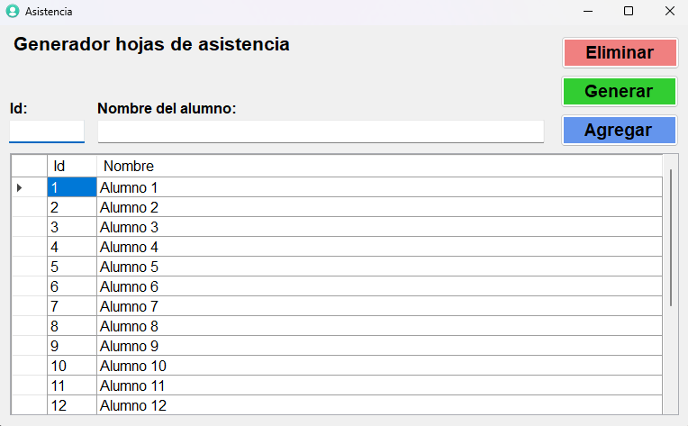
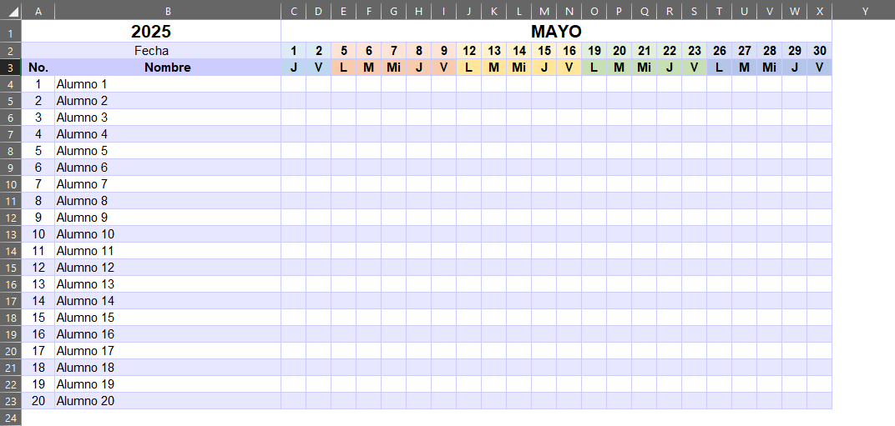

# Asistencia

Aplicación de escritorio Windows para generar hojas de asistencia mensual en Excel de manera automatizada.

    
    

El proyecto al ejecutarse la primera vez, creará un carpeta en la ruta disco **C:\Asistencia** y dentro de esta una base de datos llamada **asistencia.sqlite** usada para persistir los datos ingresados.

## Requisitos del sistema

- **Sistema operativo:** Windows 7 o superior.
- **.NET Framework:** Versión 4.7.2 o superior.
- **Dependencias:**
    - [System.Data.SQLite](https://www.nuget.org/packages/System.Data.SQLite/1.0.119.0)
    - [Dapper](https://www.nuget.org/packages/Dapper/2.1.35)
    - [EntityFramework](https://www.nuget.org/packages/EntityFramework/6.4.4)
    - [Microsoft.Office.Interop.Excel](https://www.nuget.org/packages/Microsoft.Office.Interop.Excel/15.0.4795.1001)
